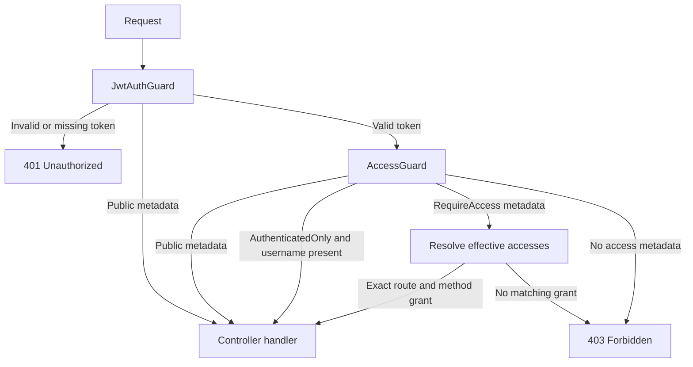

# Organization Chart API

NestJS backend for authentication, organizational units, users, and unit-scoped role-based authorization. The API uses PostgreSQL through TypeORM and delegates credential verification and provider-side authorization catalog operations to the configured authentication provider.

## Architecture

```text
src/
  common/                  Guards, decorators, provider client, errors, logging
  config/                  TypeORM configuration
  database/migrations/     Versioned PostgreSQL schema changes
  domain/modules/
    auth/                  Registration, SMS confirmation, login
    authorization/         Resources, accesses, roles, assignments, effective access
    units/                 Organizational hierarchy
    users/                 Local user records and scoped user queries
  types/                   Shared domain types
```

`AppModule` registers the global JWT guard, access guard, exception filter, feature modules, and database connection. The authorization module groups the role/access management modules; `EffectiveAccessService` is shared with the guards and user queries.

## Local Setup

Requirements: Node.js supported by the workspace, pnpm `12.5.1`, and PostgreSQL.

```bash
pnpm install
```

Copy `backend/.env.example` to `backend/.env`, create a PostgreSQL database, and fill in the local values. Do not commit `.env` or expose provider credentials or `JWT_SECRET`.

| Variable                                                         | Purpose                                                             |
| ---------------------------------------------------------------- | ------------------------------------------------------------------- |
| `PORT`                                                           | HTTP port; defaults to `3000`.                                      |
| `DB_HOST`, `DB_PORT`, `DB_NAME`, `DB_USER`, `DB_PASSWORD`        | PostgreSQL connection.                                              |
| `AUTH_BASE_URL`                                                  | Authentication provider base URL. Provider requests must use HTTPS. |
| `AUTH_SYSTEM_USERNAME`, `AUTH_SYSTEM_PASSWORD`                   | Server-side provider credentials.                                   |
| `AUTH_SMS_TEMPLATE`, `AUTH_PATTERN_NAME`, `AUTH_SMS_SYSTEM_NAME` | Provider SMS registration settings.                                 |
| `JWT_SECRET`                                                     | Locally generated signing key; at least 32 characters.              |
| `JWT_EXPIRES_IN`                                                 | Local JWT lifetime in seconds; must be a positive integer.          |

Start the API from the repository root:

```bash
pnpm --dir backend start:dev
```

The API prefix is `/api`; Swagger is available at `http://localhost:3000/api/docs` when using the default port.

## Authentication

The provider verifies credentials. This application issues its own JWT and uses the local user/authorization database for subsequent API requests.

### Registration

1. `POST /api/auth/register/username-password` looks up the submitted English role name in the local `roles` table. The current implementation checks that the role exists; it does not enforce a self-registration role allowlist.
2. The backend requests provider registration and SMS verification.
3. In a local database transaction, it creates the `users` row and an initial `role_assignments` row for the selected role. That role is also stored as the user's `providerLoginRole` for provider login.
4. If local persistence fails after provider registration, the backend attempts to delete the provider user as compensation.
5. `POST /api/auth/register/confirm-sms` confirms the code with the provider. It does not issue a JWT.

**Current route behavior:** registration and SMS confirmation are protected by `@RequireAccess`, just like other permissioned routes. Only login is public. They therefore require a valid JWT and matching route grants unless this policy is deliberately changed. Account for this when testing onboarding.

### Login and JWTs

`POST /api/auth/login/username-password` is marked `@Public`. The backend loads the local user's `providerLoginRole.name`, sends that role name and the credentials to the provider, validates the provider response, then signs a local JWT with `username` as its `sub`. The provider token is validated but is not returned or used as the API bearer token. The response also includes the local `isManager` flag; this flag is descriptive user data, not a role grant.

Protected requests send the local token as `Authorization: Bearer <token>`. `JwtStrategy` verifies its signature with `JWT_SECRET`, checks its expiration, and exposes the username on `request.user`. Tokens are not refreshed by this API; clients must log in again after expiration.

## Authorization Model

The local authorization graph is:

```text
Resource (route template)
  -> Access (HTTP method + description)
  <- RoleAccess -> Role (unit + scope mode)
                       ^
                       |
User <- RoleAssignment
```

- A **Resource** identifies a route template, for example `/users/:id`.
- An **Access** identifies an HTTP method on a resource, for example `GET` on `/users/:id`.
- A **Role** belongs to one organizational unit and has a scope mode: `SELF` or `DESCENDANTS`.
- A **RoleAccess** links a role to an access.
- A **RoleAssignment** links a user to a role. A user may have multiple assignments, but duplicate user/role pairs are rejected.
- Organizational units form a parent/child tree. `isManager` is not used to grant API access.

`EffectiveAccessService` resolves a user's assignments and their linked accesses. `SELF` includes only accesses linked to the assigned role. `DESCENDANTS` also includes accesses linked to roles anchored in descendant units. The result is deduplicated by route and method and carries the unit IDs that supplied each grant. Unit scope is then used by user queries to limit which records the caller can list, view, update, or delete.

### Request Guard Flow

The global guards run in this order: `JwtAuthGuard`, then `AccessGuard`.



Use one of these decorators on each controller handler:

```ts
@Public() // No JWT or permission required.
@AuthenticatedOnly() // Valid JWT required; no separate route grant.
@RequireAccess({ route: '/users', methodName: 'GET' }) // JWT and exact grant required.
```

Protected handlers without `@RequireAccess` or `@AuthenticatedOnly` fail closed. `@RequireAccess` compares the declared route template and uppercase HTTP method against effective grants; it does not match a concrete URL by prefix. Keep the route key identical to the corresponding Resource route and include controller/handler path segments. The global `/api` prefix is not part of the permission key.

When adding a protected endpoint:

1. Add the matching `@RequireAccess({ route, methodName })` to the handler.
2. Register that exact route as a Resource and the uppercase method as an Access.
3. Link the Access to a Role with RoleAccess, and assign that Role to users.
4. Add unit-aware data filtering in the service when the endpoint returns or mutates unit-scoped records. The global guard only decides whether the route/method is granted; it does not automatically filter query results.

The backend currently has no seed routine registered in TypeORM. A deployment must provision initial units, resources, accesses, roles, links, and assignments through its controlled bootstrap process before protected routes can be used.

## Route Reference

All paths below are under `/api`. Unless marked `Public` or `AuthenticatedOnly`, handlers require the exact route/method grant shown by their `@RequireAccess` metadata.

| Method and route                                                                           | Access rule / behavior                                                                                                  |
| ------------------------------------------------------------------------------------------ | ----------------------------------------------------------------------------------------------------------------------- |
| `POST /auth/login/username-password`                                                       | Public; provider verifies credentials; returns a local JWT.                                                             |
| `POST /auth/register/username-password`                                                    | `POST /auth/register/username-password`; creates provider and local user records.                                       |
| `POST /auth/register/confirm-sms`                                                          | `POST /auth/register/confirm-sms`; confirms provider SMS code.                                                          |
| `GET /me/accesses`                                                                         | AuthenticatedOnly; returns effective route, method, and unit grants.                                                    |
| `GET /users`                                                                               | `GET /users`; filters users to the caller's granted unit scope; supports `unitId`, `page`, `pageSize`, and `isManager`. |
| `GET /users/:id`, `PATCH /users/:id`, `DELETE /users/:id`                                  | Matching method grant on `/users/:id`; record must also belong to the caller's allowed unit scope.                      |
| `GET /units`, `POST /units`                                                                | Matching method grant on `/units`.                                                                                      |
| `GET /units/:id`, `PATCH /units/:id`, `DELETE /units/:id`                                  | Matching method grant on `/units/:id`; delete removes the selected unit subtree and cannot delete a root unit.          |
| `GET /roles`, `POST /roles`                                                                | Matching method grant on `/roles`.                                                                                      |
| `PATCH /roles/:id`, `DELETE /roles/:id`                                                    | Matching method grant on `/roles/:id`.                                                                                  |
| `GET /resources`, `POST /resources`                                                        | Matching method grant on `/resources`.                                                                                  |
| `PATCH /resources/:id`, `DELETE /resources/:id`                                            | Matching method grant on `/resources/:id`.                                                                              |
| `GET /accesses`, `POST /accesses`                                                          | Matching method grant on `/accesses`.                                                                                   |
| `PATCH /accesses/:id`, `DELETE /accesses/:id`                                              | Matching method grant on `/accesses/:id`.                                                                               |
| `GET /role-accesses/role-accesses`, `POST /role-accesses/role-accesses`                    | Matching method grant on `/role-accesses/role-accesses`. The repeated segment is the current controller route.          |
| `DELETE /role-accesses/:roleId/accesses/:accessId`                                         | Matching method grant on that exact template.                                                                           |
| `GET /role-assignments`, `POST /role-assignments`                                          | Matching method grant on `/role-assignments`.                                                                           |
| `GET /role-assignments/:id`, `PATCH /role-assignments/:id`, `DELETE /role-assignments/:id` | Matching method grant on `/role-assignments/:id`.                                                                       |

`GET /users` pagination defaults and limits are defined by its DTO and pagination helper. `unitId`, when supplied, must be among the unit IDs granted for that route/method or the request is forbidden.

## Provider and Database Boundaries

The authentication provider owns credential verification and provider-side role/resource/access records. This API stores local UUID records and provider IDs; role unit/scope data, the Farsi role name, users, and user-role assignments are local. Effective API authorization is resolved from the local database.

Provider requests go through `postToProvider`, which requires an HTTPS URL and validates the provider response envelope. Some create flows compensate for a local insert failure by deleting the newly created provider record. These calls are not a distributed transaction: update/delete flows call the provider before changing local rows, so a later database failure can leave provider and local state out of sync. User deletion has the same provider-first ordering.

PostgreSQL schema changes belong in `src/database/migrations`. Migrations are explicitly registered and run at startup; TypeORM `synchronize` is disabled. Entity IDs are UUIDs. Foreign keys use `ON DELETE NO ACTION`, so deleting a unit, role, user, resource, or access with dependent rows can fail until those references are handled. In particular, subtree deletion does not automatically remove roles assigned to those units.

## Validation and Responses

The global `ValidationPipe` transforms DTO input, strips non-whitelisted fields, and rejects unknown fields. Route IDs that use `ParseUUIDPipe` must be UUIDs. Keep request validation in DTOs with `class-validator` decorators.

Feature controllers use `FormatResponseInterceptor` for successful responses:

```json
{
  "status": "success",
  "data": {},
  "message": { "fa": "...", "en": "..." },
  "timestamp": "..."
}
```

The global exception filter normalizes errors to `status: "fail"`, `statusCode`, `message`, `timestamp`, and `path`. Provider credentials and raw internal server errors are not included in client responses or error logs.

## Development Commands

```bash
pnpm --dir backend start:dev
pnpm --dir backend build
pnpm --dir backend test
pnpm --dir backend test:e2e
pnpm --dir backend lint
pnpm --dir backend exec tsc --noEmit -p tsconfig.build.json
```

Unit and integration tests use Vitest. Keep tests beside the feature as `*.spec.ts`; the production build excludes specs. `test:e2e` uses `vitest.config.e2e.ts` and may require a running database and configured provider environment.
